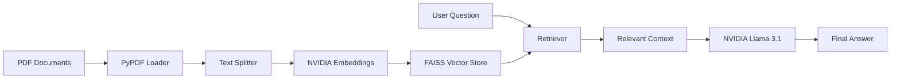

<div align="center">

# 🚀 NVIDIA NIM RAG Chatbot


<br>


</div>

---

# 📖 Overview

This project demonstrates a complete **Retrieval-Augmented Generation (RAG)** pipeline using:

- 🟢 NVIDIA NIM LLMs
- 🟢 NVIDIA Embeddings
- 🟢 LangChain
- 🟢 FAISS Vector Database
- 🟢 Streamlit UI

Upload your documents, generate embeddings, and ask questions directly from the document context.

---


---

# 🎥 Demo

<p align="center">


</p>

> Replace `assets/demo.gif` with your project demo GIF.

---

# ✨ Features

### 📄 PDF Document Processing

- Load PDFs dynamically
- Extract text efficiently
- Split large documents into chunks

### 🧠 NVIDIA Embeddings

Generate semantic embeddings using:

```python
NVIDIAEmbeddings()
```

### ⚡ FAISS Vector Store

Fast similarity search using:

```python
FAISS.from_documents(...)
```

### 🤖 NVIDIA NIM LLM

Powered by:

```python
meta/llama-3.1-70b-instruct
```

### 🔍 Context-Aware Retrieval

- Relevant chunk retrieval
- Reduced hallucinations
- Accurate responses

### 🎨 Interactive Streamlit UI

- Question Input
- Embedding Creation
- Similarity Search Viewer

---

# 🏗️ Architecture



---

# 📂 Project Structure

```bash
.
├── app.py
├── requirements.txt
├── .env
├── .gitignore
├── us_census/
│   └── documents.pdf
└── README.md
```

---

# ⚙️ Installation

## Clone Repository

```bash
git clone https://github.com/yourusername/nvidia-rag-chatbot.git

cd nvidia-rag-chatbot
```

---

## Create Virtual Environment

```bash
python -m venv venv
```

### Windows

```bash
venv\Scripts\activate
```

### Linux/Mac

```bash
source venv/bin/activate
```

---

## Install Dependencies

```bash
pip install -r requirements.txt
```

---

# 🔑 Environment Variables

Create a `.env` file:

```env
NVIDIA_API_KEY=YOUR_API_KEY
```

Get your API Key from:

https://build.nvidia.com

---

# ▶️ Run Application

```bash
streamlit run app.py
```

---

# 🧠 Example Questions

```text
What information does the document contain?

Summarize the population trends.

What are the key findings?

Explain the statistics in simple terms.
```

---

# 📊 Tech Stack

| Technology | Purpose |
|------------|----------|
| Streamlit | Frontend UI |
| LangChain | RAG Framework |
| NVIDIA NIM | LLM Inference |
| NVIDIA Embeddings | Vector Embeddings |
| FAISS | Vector Database |
| PyPDFLoader | PDF Parsing |

---

# 🌟 Future Improvements

- [ ] Multi-PDF Upload
- [ ] Chat History
- [ ] Memory Support
- [ ] Source Citations
- [ ] Hybrid Search
- [ ] Docker Deployment
- [ ] Authentication

---

# 🤝 Contributing

Contributions are welcome!

```bash
fork ➜ create branch ➜ commit ➜ push ➜ pull request
```

---

# ⭐ Support

If you found this project useful:

⭐ Star the repository

🍴 Fork the project

📢 Share it with others

---

<div align="center">


</div>